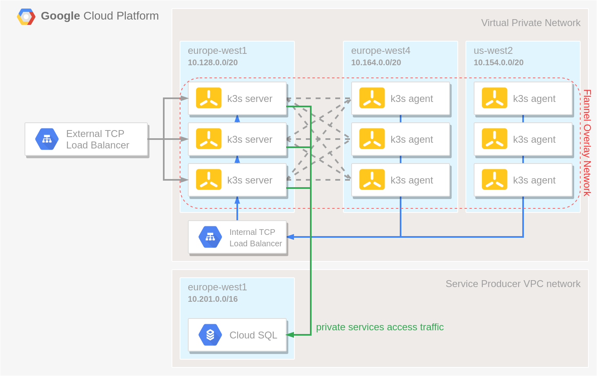

# Multi Region k3s cluster on GCP

# Todo

 [x] Upgrade K3s infra to v1.29.2+k3s1

 [x] Upgrade Cloud SQL to POSTGRES_15

 [x] Upgrade Debian to version 12

# Introduction

A HA k3s cluster build with:

- a [Cloud SQL](https://cloud.google.com/sql) instance of an external datastore
- a [Managed Instance Group](https://cloud.google.com/compute/docs/instance-groups) of server nodes that will serve the Kubernetes API and run other control plane services
- multiple [Managed Instance Groups](https://cloud.google.com/compute/docs/instance-groups) of agent nodes that will run our apps, spread across multiple regions
- an [Internal TCP Load Balancer](https://cloud.google.com/load-balancing/docs/internal) in front of the server nodes to allow the agent nodes to register with the cluster
- an [External TCP Load Balancer](https://cloud.google.com/load-balancing/docs/network) to expose to API server to allow interaction with the cluster using e.g. `kubectl`




# How to use

## Prerequisites

 - Install Terraform, v1.7.5 is used for this
 - Install gcloud CLI on your localhost 

## Deploy Cluster

 - Run through the README file in the bootstrap/ directory
 - Run ```gcloud auth login --update-adc```
 - Run ```gcloud config set project aiden-ai-copilot```
 - Modify terraform.tfvars
 - Run ```terraform plan```
 - Run ```terraform apply```
 - Run ```gcloud compute instances list --project=aiden-ai-copilot``` to list all the instances of the cluster.
 - Run ```gcloud compute scp --zone "europe-west1-b" --tunnel-through-iap --project aiden-ai-copilot k3s-server-<REPLACE WITH API SERVER IDENTIFIER>:/etc/rancher/k3s/k3s.yaml ./kubeconfig k3s.yaml``` to copy over the file.

Now you should have a kubeconfig file in your current directory. Next, take the public IP address of the TCP Load Balancer and replace 127.0.0.1 in the kubeconfig file with that IP address. The commands below let you do just that.

 - Run ```gcloud compute forwarding-rules list```
 - Run ```export IP=<IP_OF_EXTERNAL_LOAD_BALANCER>```
 - Run ```IP=$(gcloud compute addresses list --project aiden-ai-copilot | grep k3s-api-server-external | tr -s ' ' | cut -d ' ' -f 2)
sed -i "s/127.0.0.1/$IP/g" kubeconfig```

Lastly, test if you can reach the cluster:

 - Run ```kubectl --kubeconfig ./kubeconfig get nodes -o wide```

To use kubeconfig without the --kubeconfig option:

 - Run ```export KUBECONFIG=<ABSOLUTE_PATH_TO_KUBECONFIG>```
 - Run ```kubectl get nodes -o wide```

## Install ArgoCD

To install the HA version of ArgoCD:

 - Run ```wget https://raw.githubusercontent.com/argoproj/argo-cd/v2.4.7/manifests/ha/install.yaml```
 - Run ```mv install.yaml argocd-ha.yaml```
 - Run ```kubectl --kubeconfig ./kubeconfig create ns argocd```
 - Run ```kubectl --kubeconfig ./kubeconfig apply -f argocd-ha.yaml -n argocd```


## Create Cluster DNS Records

### Manually

 - Visit ```https://ie.godaddy.com/help/add-a-subdomain-4080```
 - Follow the instructions. IP is the IP of the external load balancer.

### Automated Script

Execute the following steps to automatically create the DNS records using the provided script, in my case I host my domains on GoDaddy.

 - Run ```gcloud compute forwarding-rules list```
 - Note the external IP of the load balancers
 - Populate the envfile with the needed variables
 - Run ```source envfile```
 - Run ```env | grep GO``` to make sure the environment variables have been set.
 - Modify the list in the domain_reg.sh file with the subdomains you want and their associated IP's (in this case, the external LB IPs)
 - Run ```chmod +x domain_reg.sh && ./domain_reg.sh``` and it should create the records for you.
