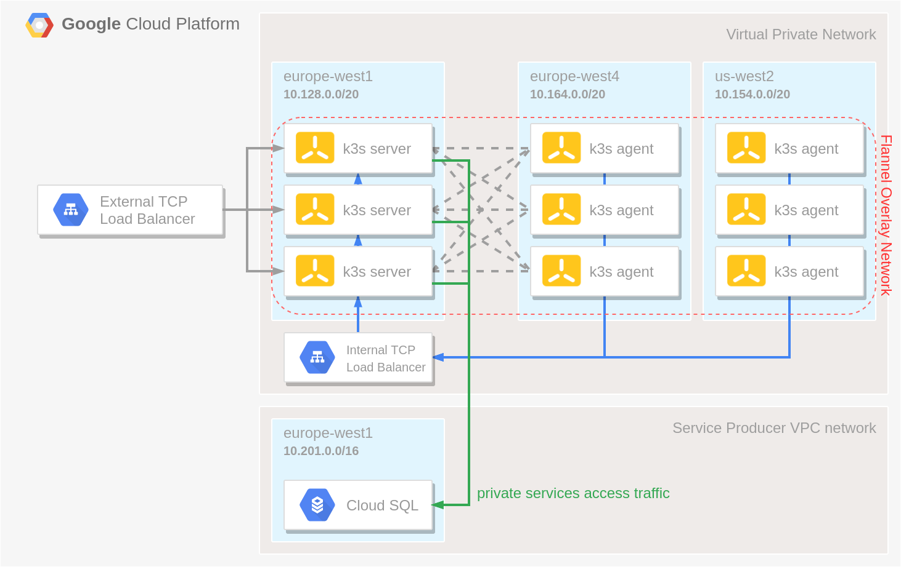

# Multi Region k3s cluster on GCP


A HA k3s cluster build with:

- a [Cloud SQL](https://cloud.google.com/sql) instance of an external datastore
- a [Managed Instance Group](https://cloud.google.com/compute/docs/instance-groups) of server nodes that will serve the Kubernetes API and run other control plane services
- multiple [Managed Instance Groups](https://cloud.google.com/compute/docs/instance-groups) of agent nodes that will run our apps, spread across multiple regions
- an [Internal TCP Load Balancer](https://cloud.google.com/load-balancing/docs/internal) in front of the server nodes to allow the agent nodes to register with the cluster
- an [External TCP Load Balancer](https://cloud.google.com/load-balancing/docs/network) to expose to API server to allow interaction with the cluster using e.g. `kubectl`




# How to use

 - Modify terraform.tfvars
 - Run ```terraform plan```
 - Run ```terraform apply```
 - Run ```gcloud compute instances list --project=aiden-ai-copilot``` to list all the instances of the cluster.
 - Run ```gcloud compute scp --zone "europe-west1-b" --tunnel-through-iap --project aiden-ai-copilot k3s-server-<REPLACE WITH API SERVER IDENTIFIER>:/etc/rancher/k3s/k3s.yaml ./kubeconfig k3s.yaml``` to copy over the file.

Now you should have a kubeconfig file in your current directory. Next, take the public IP address of the TCP Load Balancer and replace 127.0.0.1 in the kubeconfig file with that IP address.

 - Run ```export IP=$(gcloud compute addresses list --project $PROJECT | grep k3s-api-server-external | tr -s ' ' | cut -d ' ' -f 2) sed -i "s/127.0.0.1/$IP/g" kubeconfig```

Lastly, test if you can reach the cluster:

 - Run ```$ kubectl --kubeconfig ./kubeconfig get nodes -o wide```
